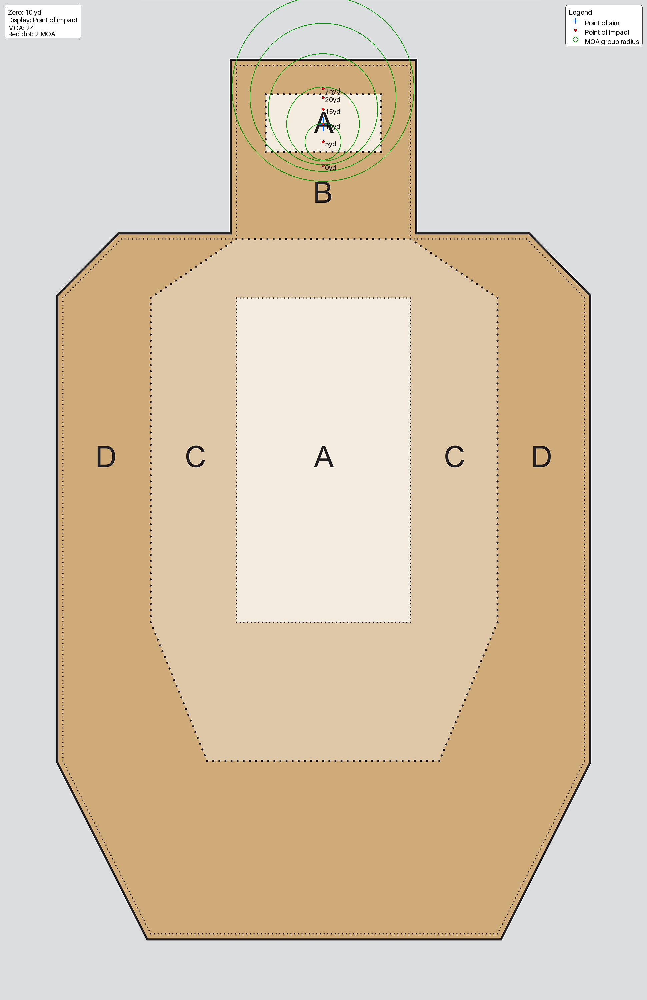
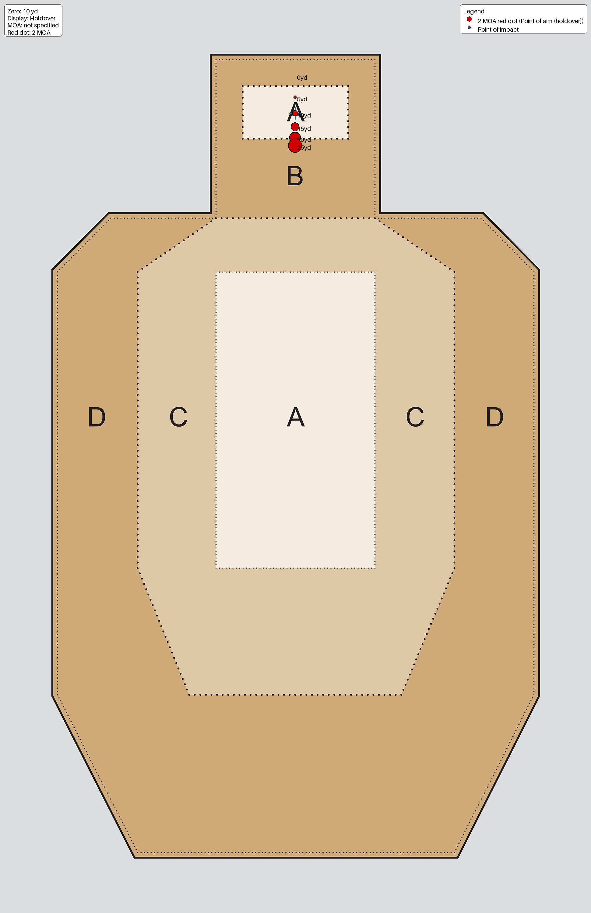
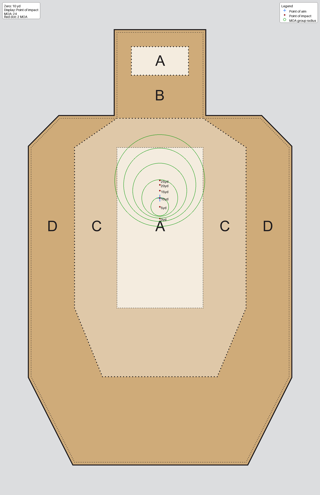
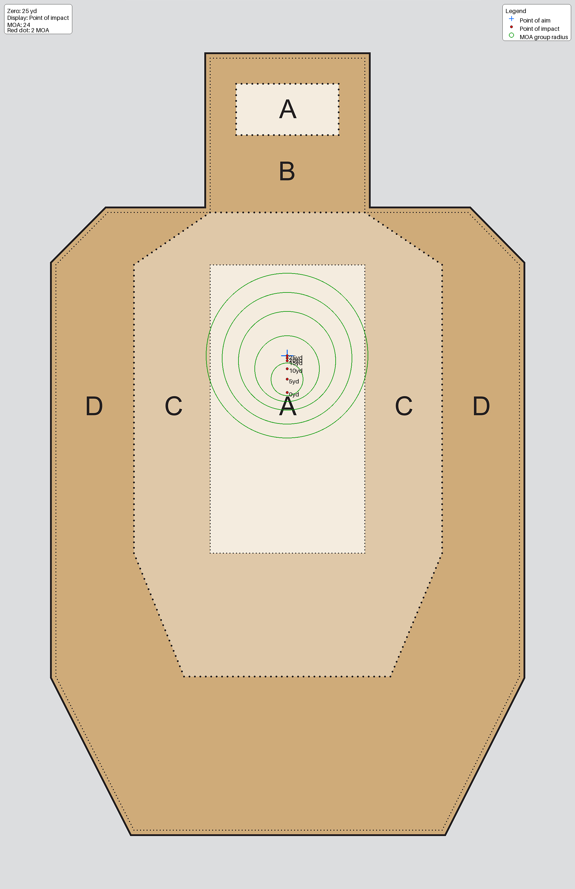
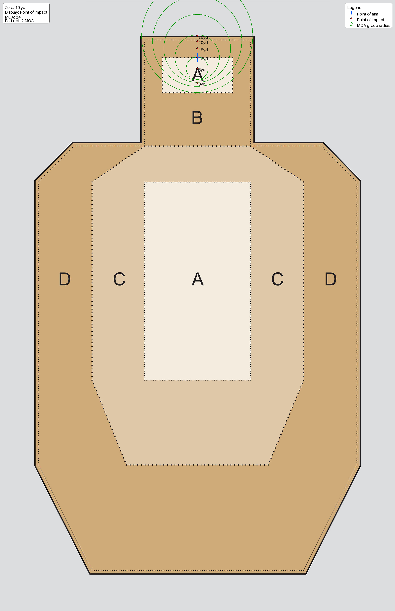

# Zero Comparison: 10 yd vs 25 yd

This document summarizes the generated impact and holdover images and explains why a 25-yard zero is usually the better general-purpose choice.

## What These Images Show

- Point of aim: where you are aiming.
- Point of impact: where the round will hit.
- Impact mode blue cross: point of aim.
- Impact mode red dot: point of impact.
- Holdover mode blue cross: point of impact.
- Holdover mode red dot: point of aim (holdover point), rendered as a 2 MOA dot.
- Green circles (when shown): expected group size based on 24 MOA (6" group at 25yd).
- Upper-left note: zero distance, display mode, MOA, and red-dot MOA.
- Upper-right note: legend for symbols.

## Head A-Zone: 10 yd and 25 yd Zero

### 10 yd zero

#### Impact

#### Holdover

### 25 yd zero

#### Impact

#### Holdover

## Body A-Zone: 10 yd and 25 yd Zero

### 10 yd zero

#### Impact

#### Holdover

### 25 yd zero

#### Impact

#### Holdover

## Top of Head A-Zone Perf (Impact Mode)

### 10 yd zero

### 25 yd zero

## Body A-Zone With 1 in Windage Zero Error (Impact Mode Only)

These images visualize what being 1 inch off in windage at the zero distance does to point of impact at various ranges.

### 10 yd zero with windage error

### 25 yd zero with windage error

## My opinion of the advantages of a 25yd zero

- Point of impact is always between ~1.5" low and point of aim from 0 to 50yd.
- This results in a simpler mental model under stress, most penalty targets are placed below the scoring zone in USPSA. Only having to hold 1.5" high at all practical ranges simplifes picking the correct POA
- More robust to error in zero: with windage/zero error introduced, a 25-yard baseline usually keeps dispersion easier to diagnose and correct. With targets like tuxedo targets holding the center of the a-zone with a windage error in your zero will produce a greater probability of hit with the vast majority of the rounds impacting inside the a-zone out to 25yd" with a 25yd zero.

## Why a 1 in Zeroing Error Hurts 10 yd Zero More

The zero-error comparison images show why setup quality matters:

- 10-yard zero with 1 inch windage error: [img_body_10yd_zero_w_error_impact.png](img_body_10yd_zero_w_error_impact.png)
- 25-yard zero with 1 inch windage error: [img_body_25yd_zero_w_error_impact.png](img_body_25yd_zero_w_error_impact.png)

Key takeaway from these two plots:

- The 10-yard zero is more sensitive to being off during zeroing.
- A 1-inch setup miss at 10 yards creates a larger practical penalty as distance changes because that error propagates more
- The 25-yard zero better damps that effect, so the same zeroing mistake is less disruptive to where rounds land in the scoring zone.

