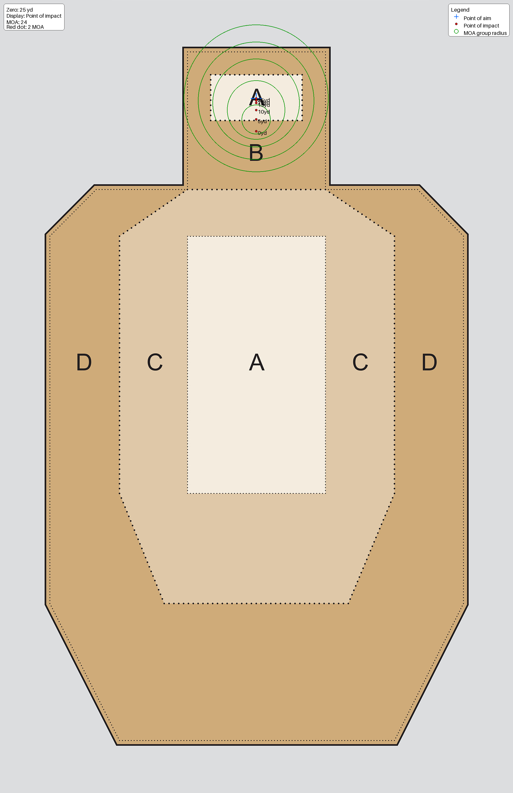
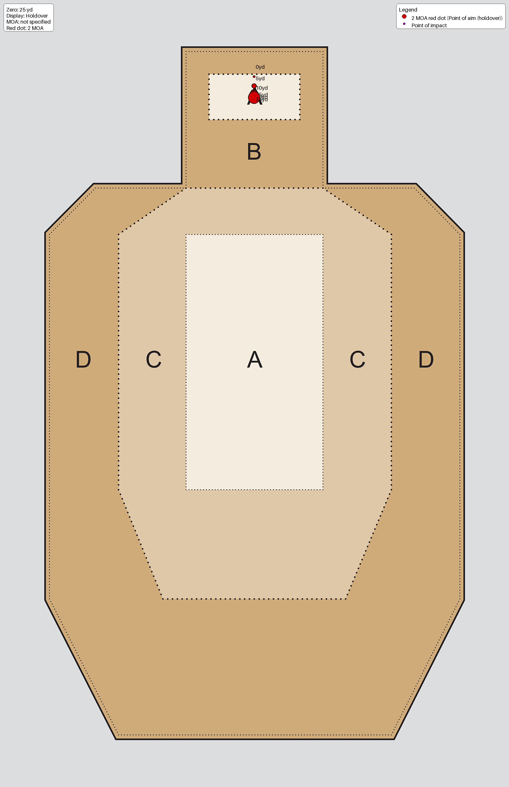
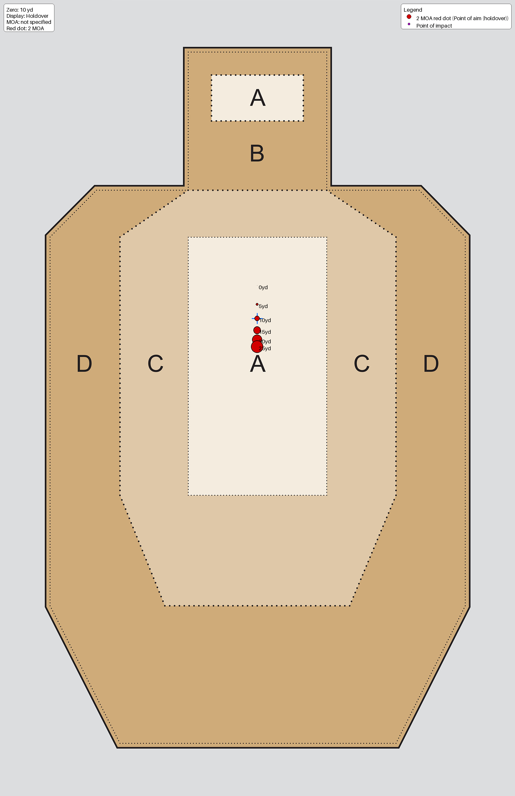
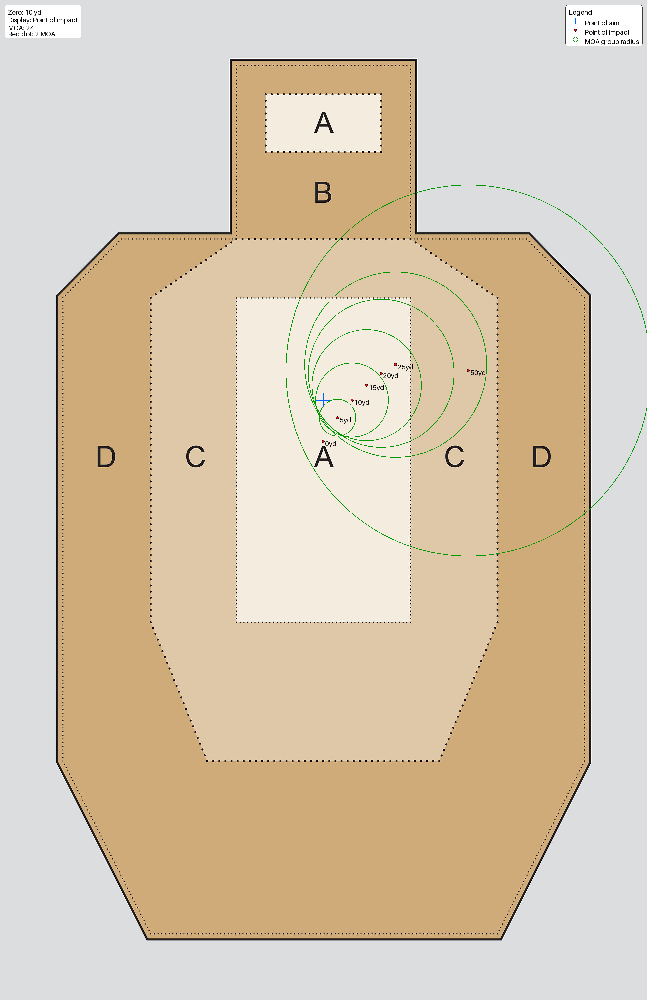
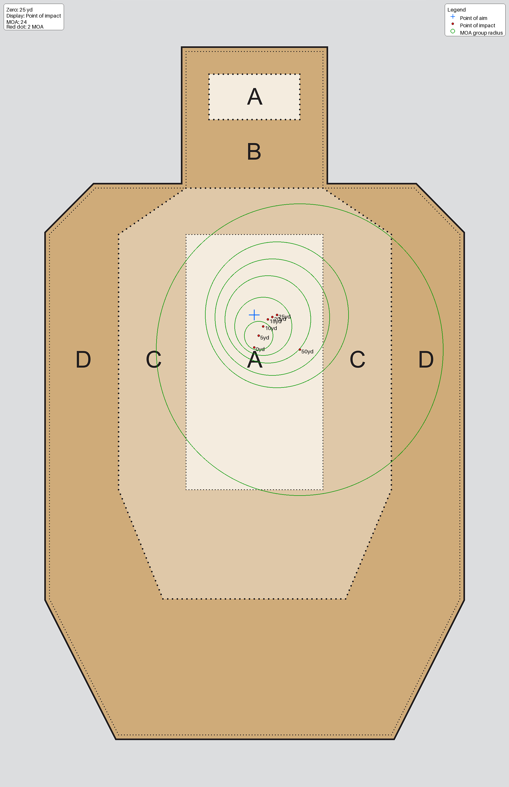

# Zero Comparison: 10 yd vs 25 yd

This document summarizes the generated impact and holdover images and explains why a 25-yard zero is usually the better general-purpose choice.

## What These Images Show

- Point of aim: where you are aiming.
- Point of impact: where the round will hit.
- Impact mode blue cross: point of aim.
- Impact mode red dot: point of impact.
- Holdover mode blue cross: point of impact.
- Holdover mode red dot: point of aim (holdover point), rendered as a 2 MOA dot.
- Green circles (when shown): expected group size from the specified 24 MOA (impact images).
- Upper-left note: zero distance, display mode, MOA, and red-dot MOA.
- Upper-right note: legend for symbols.

Target points used:

- Head A-zone center: x=969, y=372
- Body A-zone center: x=969, y=1200
- Head A-zone top perf: x=969, y=282

## Head A-Zone: 10 yd and 25 yd Zero

### 10 yd zero

| Impact | Holdover |
|---|---|
|  |  |

### 25 yd zero

| Impact | Holdover |
|---|---|
|  |  |

## Body A-Zone: 10 yd and 25 yd Zero

### 10 yd zero

| Impact | Holdover |
|---|---|
|  |  |

### 25 yd zero

| Impact | Holdover |
|---|---|
|  |  |

## Top of Head A-Zone Perf (Impact Mode)

| 10 yd zero | 25 yd zero |
|---|---|
|  |  |

## Body A-Zone With 1 in Windage Zero Error (Impact Mode Only)

These images use the _w_error datasets to visualize what being 1 inch off in windage at zero does to outcomes.

### 10 yd zero with error

### 25 yd zero with error

## Why the 25 yd Zero Is Advantageous

- Better mid-range consistency: the 25-yard zero generally reduces total vertical correction burden as distance extends beyond very close range.
- More forgiving trajectory management: holds tend to be smaller and more predictable in common practical distances.
- Better alignment with precision shots: especially near the upper head A-zone and perf line, the 25-yard zero often keeps required correction more stable.
- Cleaner mental model under stress: fewer large hold transitions means less decision friction between short and moderate distances.
- More robust to setup error: with windage/zero error introduced, a 25-yard baseline usually keeps dispersion behavior easier to diagnose and correct.

## Why 25 yd Zero Simplifies Practical Pace Shooting

At practical cadence, simplicity wins. A 25-yard zero gives a very usable rule of thumb:

- Hold center for most shots.
- For tighter precision work, use only a small correction, about 1 inch high.
- You avoid large or constantly changing hold calls as distance shifts.

From a shooter workflow standpoint, this means:

- Less time thinking about holds and more time processing sights and trigger control.
- Faster transitions between body and head scoring zones.
- Better consistency under stress because the required adjustment is small and repeatable.

Using the generated impact images, the practical benefit is visible: the 25-yard zero keeps impact behavior predictable enough that you can run pace while still keeping rounds in the scoring area when your point of aim is managed with that small correction.

Another useful way to say it: with a 25-yard zero your trajectory relationship to point of aim stays easier to manage, and the bullet remains below point of aim in the near range context shown here, so your correction plan stays simple.

## Why a 1 in Zeroing Error Hurts 10 yd Zero More

The zero-error comparison images show why setup quality matters:

- 10-yard zero with 1 inch windage error: [img_body_10yd_zero_w_error_impact.png](img_body_10yd_zero_w_error_impact.png)
- 25-yard zero with 1 inch windage error: [img_body_25yd_zero_w_error_impact.png](img_body_25yd_zero_w_error_impact.png)

Key takeaway from these two plots:

- The 10-yard zero is more sensitive to being off during zeroing.
- A 1-inch setup miss at 10 yards creates a larger practical penalty as distance changes because that angular error propagates more aggressively in your usable envelope.
- The 25-yard zero better damps that effect, so the same zeroing mistake is less disruptive to where rounds land in the scoring zone.

In plain terms, the 25-yard zero is not just easier to run quickly, it is also more forgiving if your initial zero is not perfect.

## Practical Takeaway

If your use case spans close to moderate distances, the 25-yard zero is typically the stronger default. It gives a better compromise between close-range offset management and downrange predictability, supports a practical pace with a simple small-correction strategy, and is generally less punishing when zeroing is imperfect.

## Image Inventory

- [img_head_10yd_zero_impact.png](img_head_10yd_zero_impact.png)
- [img_head_10yd_zero_holdover.png](img_head_10yd_zero_holdover.png)
- [img_head_25yd_zero_impact.png](img_head_25yd_zero_impact.png)
- [img_head_25yd_zero_holdover.png](img_head_25yd_zero_holdover.png)
- [img_body_10yd_zero_impact.png](img_body_10yd_zero_impact.png)
- [img_body_10yd_zero_holdover.png](img_body_10yd_zero_holdover.png)
- [img_body_25yd_zero_impact.png](img_body_25yd_zero_impact.png)
- [img_body_25yd_zero_holdover.png](img_body_25yd_zero_holdover.png)
- [img_head_top_perf_10yd_zero_impact.png](img_head_top_perf_10yd_zero_impact.png)
- [img_head_top_perf_25yd_zero_impact.png](img_head_top_perf_25yd_zero_impact.png)
- [img_body_10yd_zero_w_error_impact.png](img_body_10yd_zero_w_error_impact.png)
- [img_body_25yd_zero_w_error_impact.png](img_body_25yd_zero_w_error_impact.png)
